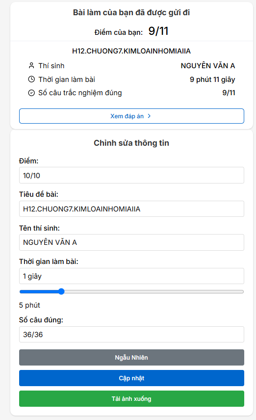

# Tạo ra kết quả fake cho bài thi Azota

## Tính Năng

- Hiển thị kết quả bài thi với thông tin có thể tùy chỉnh
- Chỉnh sửa thông tin học sinh và điểm số
- Tạo ngẫu nhiên điểm số và thời gian hoàn thành
- Tải xuống trang kết quả dưới dạng hình ảnh
- Thiết kế tương thích với điện thoại và máy tính

## Cách Sử Dụng

Trang web hiển thị hai phần chính:
   - Phần hiển thị kết quả bài thi
   - Biểu mẫu chỉnh sửa

### Chỉnh Sửa Thông Tin

Bạn có thể sửa đổi các trường sau trong biểu mẫu:
- Điểm số (ví dụ: "9/10")
- Tiêu đề bài thi
- Tên học sinh
- Thời gian làm bài (sử dụng thanh trượt hoặc nhập trực tiếp)
- Số câu trả lời đúng

### Các Nút Chức Năng

- **Ngẫu Nhiên**: Tạo giá trị ngẫu nhiên cho thời gian và điểm số
- **Cập nhật**: Áp dụng các thay đổi vào phần hiển thị
- **Tải ảnh xuống**: Lưu phần hiển thị kết quả dưới dạng ảnh PNG

### Chức Năng Ngẫu Nhiên

- Tự động tính toán theo thang điểm 10 theo số câu chỉ định(18/20 là 9/10 điểm)
- Luôn ngẫu nhiên điểm trên 8/10

### Thanh Trượt Thời Gian

- Sử dụng thanh trượt để điều chỉnh thời gian làm bài
- Thời gian sẽ được hiển thị theo phút và giây
- Phạm vi: 2-20 phút

## Ví Dụ Sử Dụng

1. Nhập thông tin học sinh:
   - Điểm số: "9/10"
   - Tiêu đề bài thi: "H12.CHUONG7.KIMLOAINHOMIAIIA"
   - Tên học sinh: "NGUYÊN VĂN A"
   - Thời gian: Sử dụng thanh trượt hoặc nhập trực tiếp
   - Số câu đúng: "18/20"

2. Nhấn "Cập nhật" để xem thay đổi

3. Nhấn "Tải ảnh xuống" để lưu thành ảnh

## Tương Thích Trình Duyệt
Hoạt động tốt nhất trên các trình duyệt hiện đại:
- Chrome
- Firefox
- Edge
- Safari

## Lưu Ý

- Chỉ tạo kết quả "ảo". Không gửi đến server

## Các Thay Đổi(Update)
- Hiện tại chưa có thay đổi gì
